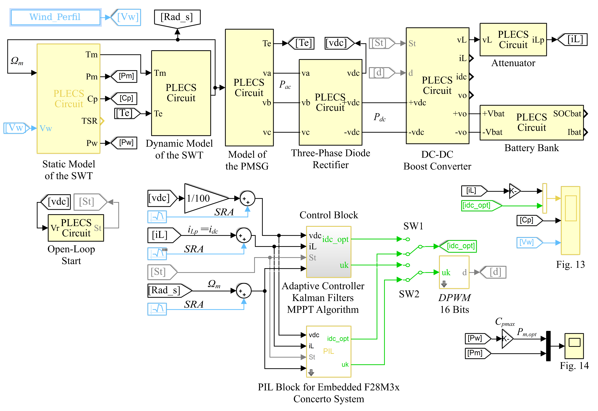

# Discrete-Time-Adaptive-PID-Current-Controller-for-Wind-Boost-Converter
This repository presents the simulation file used to demonstrate the effectiveness of the Discrete-Time Adaptive PID Current Controller for a Wind Boost Converter.

The following figure shows the block diagram of the small-scale wind turbine system circuit implementation based on the PIL simulation approach, which requires the Wind_Perfil variable to be executed and the embedded F28M3x concerto system connected to the COM6 serial port computer.

The simulation can be ejecuted without PIL mode by removing the PIL Block and moving SW´s 1 and 2 up, as shown in the figure below.

